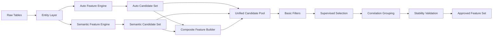

# Dual Engine Candidate Architecture

## Goal

Build a single candidate pool from two independent sources:

- `auto_features`: generated from entity graph + primitives.
- `semantic_features`: handcrafted business features from fraud hypotheses.

Then apply a unified selection layer to produce model-ready and rule-ready features.

## Flow

## Output Contracts

- Candidate pool: one row per `SK_ID_CURR`, with `TARGET`.
- Feature registry: source, definition, risk direction, owner, status.
- Selection reports: scorecard, correlation groups, kept/dropped reasons.

## Operational Principles

- Keep feature source labels (`auto` / `semantic` / `composite`).
- Keep selection policy source-agnostic but with source-specific thresholds.
- Keep fraud-rule features in a separate retention policy to avoid accidental deletion.
